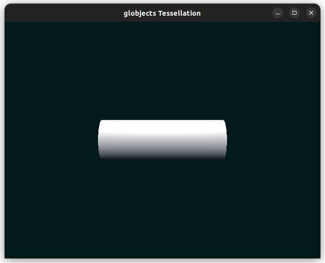
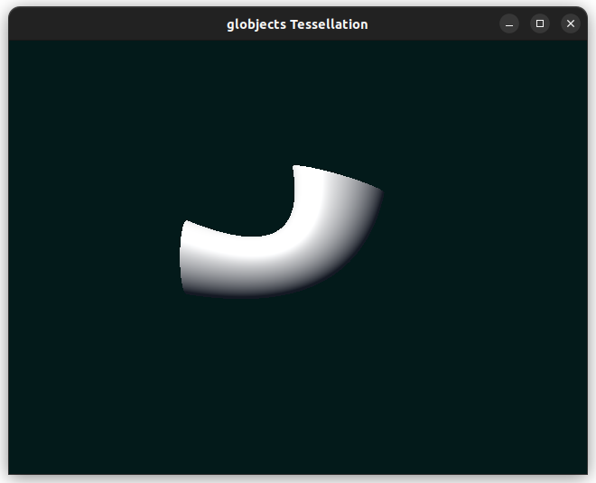

# Compilation instruction

## first clone with submodule

```{.sh}
git clone --recurse-submodules git@github.com:Carl-Delrieu/Projet_IG_23_24.git Animation
```

## second builds external

```{.sh}
cd Animation
cmake -S . -B build
cmake --build build -j 
```

This will install the dependencies in Animation/external/Bundle-GNU (or similar depending on your compiler)


## Then build the main project

go back to Animation
cmake -S . -B build

```{.sh}
cd ../
```

and build with the external install dir specified

```{.sh}
cmake -S . -B build  -DCMAKE_PREFIX_PATH=external/Bundle-GNU/
cmake --build build -j
```

run `./Bundle-GNU/Debug/bin/main-app` 


___

# Consignes

Travail à faire (en partant du code fourni, à adapter suivant ce que vous avez) :
- [x] définir une classe Bone contenant une transformation
- [x] ajouter les données de poids au Vertex
- [x] calculer les poids pour chaque Vertex
- [x] définir 2 Bones succéssif dont les articlulations se trouvent respectivement à la base et au milieu du cylindre
- [x] animer l'articulation du milieu (vous pouvez ajouter des primitives visuelles pour afficher avec deux segments les deux bones)
- [ ] ajouter au maillage une donnée "pose de référence"
- [x] animer les points du maillage en CPU (et mettre à jour les données sur le GPU)
- [x] effectuer le même calcul sur GPU (en envoyant les poids et les matrices de transformation au shader).

___

# Rapport de projet d'animation

Pour la partie animation je me suis contenté de faire une animation simple, c'est à dire que j'ai essayé de faire bouger les deux os dans un cylindre. Pour cela j'ai implémenté une classe `Bone` qui contient une `transformation` et son `inverse` (pas encore utilisé pour cette dernière). 

J'ai également ajouté les données de poids au `Vertex` ainsi que le calcul des poids pour chaque `Vertex`, dans le but de pouvoir animer les points du maillage en `CPU`.

J'ai par la suite ajouté `.vert` afin de pouvoir effectuer le même calcul sur le `GPU` (en envoyant les poids et les matrices de transformation au shader) pour pouvoir animer les points du maillage de façon plus efficace.

Pour lancer le projet sur `GPU` il suffit de lancer `./Bundle-GNU/Debug/bin/main-app -gpu`. Pour la version `CPU` il suffit de lancer `./Bundle-GNU/Debug/bin/main-app` ou `./Bundle-GNU/Debug/bin/main-app -cpu`.

Je n'ai pas réussi à ajouter au maillage une donnée "pose de référence" ni à faire en sorte que l'influence des os sur les points du maillage soit visible. De plus, je n'ai pas réussi à faire une articulation plus propre pour le cylindre en gérant le "collapse" de l'articulation, tout cela par manque de temps.

Voici quelques images de l'animation que j'ai réussi à faire pour illustrer mon travail :
<table> 
    <tr>
        <td>  </td>
        <td>  </td>
    </tr>
</table>
